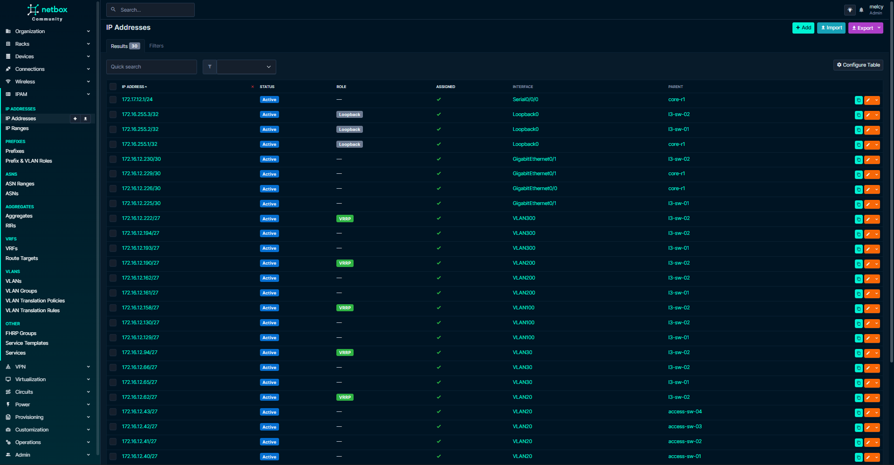

# NetBox - Source of Truth

This repository builds on concepts and workflows from a previous [Automated Enterprise Network](https://github.com/m3lcy/enterprise-network) I designed, which simulated a high-availability automated infrastructure. The device interface data used for netbox is pulled from my [Network Automation Platform](https://github.com/m3lcy/network_automation) used to manage and configure live devices.

## **Why Netbox?**
NetBox acts as the Source of Truth (SoT) - a centralized, API-first database that ensures the intended state of the network is documented before it is deployed. I used NetBox as the intended state, defining what the network should be. <br>
**Official NetBox Repository:** https://github.com/netbox-community/netbox

By using NetBox as an SoT I have enabled:

- Automated Bootstrap: Programmatic creation of the entire network hierarchy (Regions, Sites, Roles, etc.) using pynetbox.
- Idempotent Data Sync: Custom get_or_create logic ensures scripts can be re-run safely without duplicating data or breaking existing relationships.
- L2/L3 Relational Mapping: Automatically linking IP Prefixes to VLANs and physical interfaces to document the full stack from Layer 1 to Layer 3.
- Granular Interface State: Mapping complex port configurations (802.1Q Trunks, Native VLANs, and Access modes) through device specific YAML definitions.

## Data Flow & Execution
To maintain database integrity and satisfy object dependencies, the synchronization follows a strict order:

```csv_upload.py``` (Global Reference Data)

- Bootstraps the foundation: Regions → Sites → Manufacturers → Device Roles → Device Types → Module Types → Devices → ... <br>
- Defines the logical IPAM space: VLANs and IP Prefixes. <br>


```sync_interfaces.py``` (Physical Mapping)

- Parses [data/devices/interfaces/*.yaml](https://github.com/m3lcy/netbox-sot/tree/main/data/devices/interfaces) <br>
- Sets interface modes (Access/Trunk) and assigns VLAN memberships. <br>


```sync_ips.py``` (L3 Binding)

- Assigns management and gateway IPs to the specific interfaces defined in the previous step.



```
netbox-sot/
├── data/
│   ├── csv/             # Bulk definitions for global objects
│   └── devices/         # Per-device YAML interface and port-maps
├── modules/             # API Client (pynetbox), Config, and Logging utilities
└── scripts/             # Execution scripts for data synchronization
```

##
**TechStack** <br>
**Netbox**, **Docker**, **Python**, **YAML** 