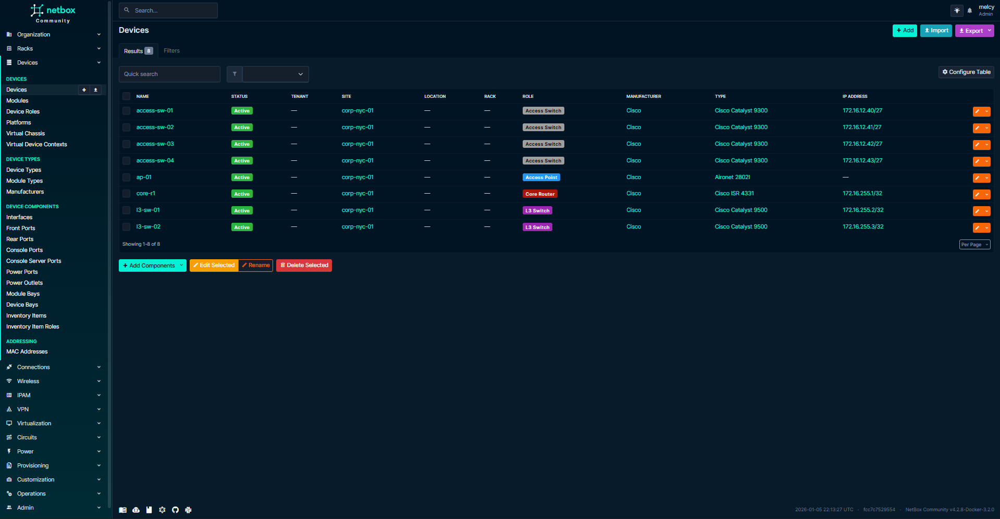
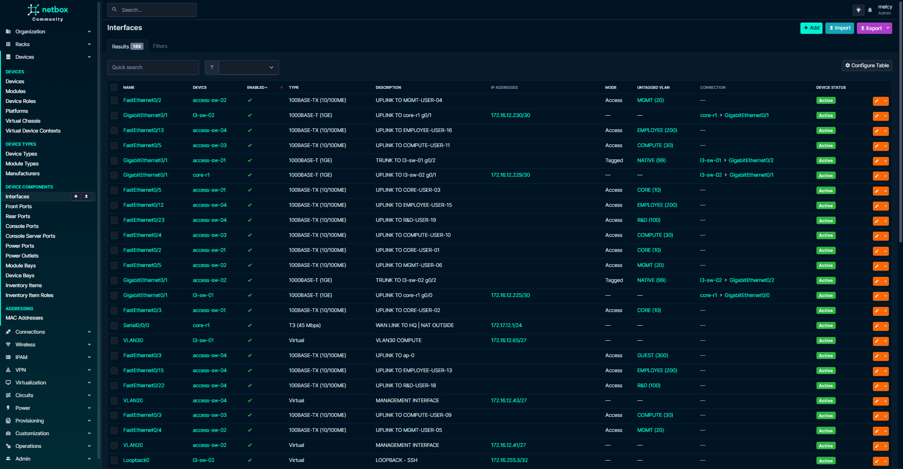

# Netbox-Config-Engine

> [!NOTE]
> I am currently rebuilding this project from the ground up to improve the architecture, performance and for better adaptability when implementing with other projects. Everything under here is the old architecture i did a couple months back and will be taken down slowly and rebuilt.

## Overview

The Netbox Configuration Engine builds on concepts and workflows from a previous [Enterprise Automation Network](https://github.com/m3lcy/Enterprise-network) I designed, which simulated a high-availability automated infrastructure. In this follow-up project, I focused on extending those concepts into a more modern, production-style network automation workflow.

The goal is to showcase how infrastructure teams can centralize their network data, reduce human error, and enforce consistent, scalable config generation across multiple devices and sites all within a fully local and cloud environment.

##
Netbox Configuration Engine is a simulation environment designed to model a modern enterprise network automation workflow using NetBox as a **Source of Truth (SoT)**. The project leverages **Ansible**, **Jinja2**, and **Python** to dynamically generate network device configurations based on structured IPAM and topology data stored in NetBox, thereby reflecting **Infrastructure-as-Code (IaC)** principles used in production environments.

This project facilitates configuration consistency, reduces manual intervention, and provides a reproducible, API-driven foundation for managing network infrastructure all within a fully containerized and mock-driven simulation.

##
**Objective**

- Model network infrastructure declaratively using NetBox.

- Programmatically extract inventory, interface, and IP data via the NetBox API.

- Automate the generation of device configurations using Ansible and Jinja2.

- Simulate configuration deployment in a controlled, testable environment.

- Establish an extensible framework for future integration with real devices and CI/CD workflows.

##
**Architecture**
```
┌────────────┐        API         ┌────────────────────┐
│  NetBox    ├───────────────────▶ Python Script       │
└────────────┘     (pynetbox)     └────────────────────┘
                                    ▼
                         ┌────────────────────────────┐
                         │ Dynamic Ansible Inventory  │
                         │     (YAML/JSON Format)     │
                         └────────────────────────────┘
                                    ▼
                         ┌────────────────────────────┐
                         │     Jinja2 Templates        │
                         └────────────────────────────┘
                                    ▼
                         ┌────────────────────────────┐
                         │     Ansible Playbooks       │
                         └────────────────────────────┘
                                    ▼
                  ┌────────────────────────────────────────────┐
                  │      Simulated / Staged Config Deployment   │
                  └────────────────────────────────────────────┘
                                    ▲
                                    │
                         (Validation / Logs / Feedback)
```


##
**Screenshots**

Devices


Cables


Interfaces


##
**TechStack**

**Netbox**, **Docker**, **Git**, **Python**, **Jinja2**, **Ansible**


```
                                        &
                                     &&&            &
                                     &&&&&      && &&
                                  & \|&      & &&&& &&&
                                   &&&/   &&&&&&   |/&&
                                   &&| & &&&&&&&&&/|\&&
                                     |/   &&/|&|&\&&&&
                                 &  &|\&  &\/&&&& \|&&&
                           & &   &  /~&&   |/~&&&||/~
                          &&&&&&&&& & /~&&/~~&&&/|/
                           \&&&&||& \  \| /|\&&//~\
                          &&&  \ \_\__  /|/|\\&\|_  & &
                           &            \|\|   /~~&&  &&&&&
                                         /~|/ &|/  & &/ &
                                          \|  /|\ & &&&&
                                           /~//~ &&&&
                                           /~\|    &
                                          //|///_/ &     & &&
                                           \_/____/__/  &/&  &  &&
                                            /~|/      / &&&/&&&&&&
                                             /~~       &&  &&&& &
                              :___________./~~~\.___________:
                               \                           /
                                \_________________________/
                                (_)                     (_)
```
